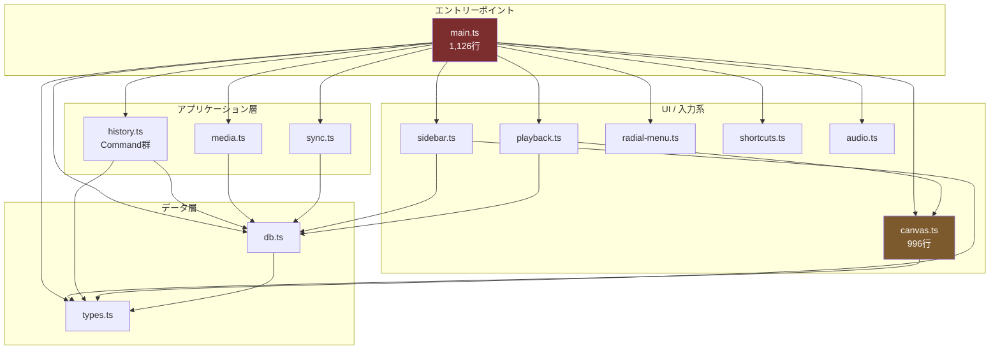
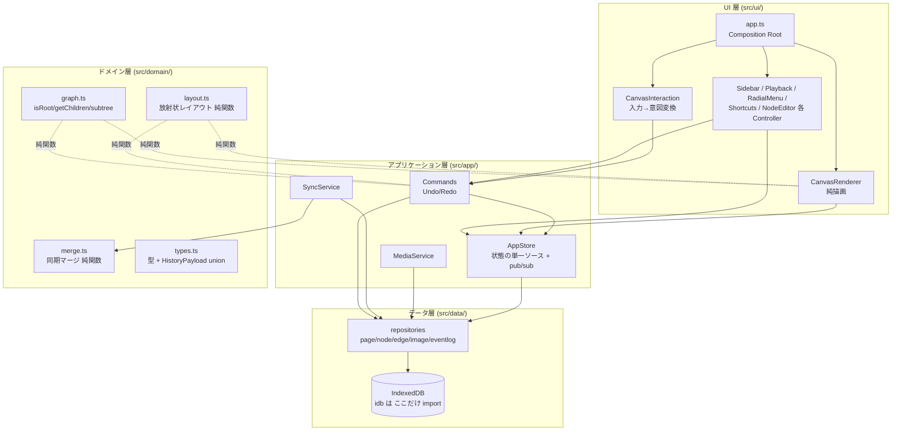

# ChronoMap リファクタリング計画書

作成日: 2026-06-12
対象リビジョン: `51e659a` (master)
分析対象: `src/` 配下の全 TypeScript ファイル（計 約 4,300 行）

> **本書は分析と提案のみを記述する。コード変更は含まない。**

---

## 1. 現状の依存関係と構造的ボトルネック

### 1.1 モジュール依存グラフ（import レベル）



| モジュール | 依存先 | 被依存元 | 備考 |
|---|---|---|---|
| `types.ts` | なし | ほぼ全部 | 健全（純粋な型定義） |
| `db.ts` | idb, types | main, history, media, sync, sidebar, playback | 健全だが**バイパスされている**（後述） |
| `canvas.ts` | types | main, playback | 描画・入力・データ保持・ヒットテストを兼任 |
| `history.ts` | db, types | main | Command パターン。UI コールバックを内包 |
| `main.ts` | **全12モジュール** | なし | 神オブジェクト |

**import 文レベルでの循環依存は存在しない。** これは良い点である。しかし以下のとおり、import に現れない「実質的な循環結合」が複数ある。

### 1.2 ボトルネック①: `main.ts` ⇄ `MindMapCanvas` の隠れた循環依存（最重要）

`main.ts` は `MindMapCanvas` の **private メンバへブラケット記法でアクセス**し、TypeScript のアクセス制御を全面的に迂回している。確認できた箇所:

```
canvasManager['nodes']               × 5箇所 (main.ts:172, 288, 563, 642, 929 ほか)
canvasManager['edges']               × 3箇所
canvasManager['currentPlaybackTime'] × 10箇所超（再生中ガードとして散在）
canvasManager['scale'] / ['offsetX'] / ['offsetY']  (main.ts:181-184, 269-272)
canvasManager['canvas']              (main.ts:177, 838-840)
canvasManager['calculateNodeSize']   (main.ts:175, 264, 856)
canvasManager['screenToWorld'] / ['findNodeAt']  (main.ts:848-849)
canvasManager['imageCache'] / ['hoveredNodeId'] / ['isHoveringPlusBtn']  (main.ts:852-863)
canvasManager['NODE_PADDING_X'] / ['NODE_PADDING_Y']  (main.ts:860-861)
playbackManager['isPlaying']         (main.ts:121)
```

これにより:

- **canvas → main はコールバック、main → canvas 内部状態は直接参照**という双方向結合になっており、グラフ上は一方向に見えるが実態は循環している。
- `canvas.ts` 側のフィールド名変更・内部構造変更が即座に `main.ts` を壊す（コンパイラが検知できない）。
- 座標変換ロジック（world→screen）が `canvas.ts:356-359`（描画）、`main.ts:181-184`（インライン編集開始）、`main.ts:269-272`（テキストエリア追従）の **3箇所に複製**されている。
- `main.ts:838-892` の画像クリック判定は、canvas 内部の描画レイアウト計算（パディング・画像アスペクト比）を main 側で**丸ごと再実装**しており、描画ロジックと二重管理。

### 1.3 ボトルネック②: `main.ts` の God Object 化

`main.ts`（1,126行）が抱えている責務:

1. アプリ全体のグローバル状態（`currentPageId`、各マネージャ参照、編集中ノード）
2. 全マネージャの生成と相互配線（コールバックの結節点）
3. インラインテキスト編集の DOM 管理（textarea の生成・座標追従・commit/cleanup）
4. 音声入力フローのオーケストレーション（`startSpeechRecognition`、canvas のノード text を**直接ミューテート**して仮表示: main.ts:299）
5. **ドメインロジック**: 放射状自動レイアウトアルゴリズム（`runAutoLayout`, main.ts:452-558）、子ノード配置位置の探索ヒューリスティック（main.ts:650-696）
6. ページタイトル更新の永続化 + 履歴記録（main.ts:432-439。Command を経由しないため **Undo 不可能**で他操作と非対称）
7. 画像拡大モーダル、ヘルプモーダル、サイドバー開閉などの雑多な UI イベント

特に (5) のレイアウトアルゴリズムは純粋関数化できる計算ロジックであり、UI 配線ファイルに置く必然性がない。

### 1.4 ボトルネック③: データ層（db.ts）のバイパスとレイヤー越え

`db.ts` は CRUD API を提供しているにもかかわらず、複数モジュールが `db.getDB()` で **生の IndexedDB トランザクションを直接操作**している:

| 違反箇所 | 内容 |
|---|---|
| `history.ts:83-91` (AddNodeCommand.execute) | Redo 時に `database.put('nodes', ...)` を直接実行。さらに `createdAt` を現在時刻で上書きするため、**Redo するとタイムライン上のノード出現時刻がズレる**仕様バグの温床 |
| `history.ts:266-343` (DeleteNodeCommand) | 独自トランザクションでカスケード削除を実装。`db.deleteNode()` と**ロジック重複** |
| `history.ts:165, 185, 215, 235` | `db.getDB().then(d => d.get('nodes', ...))` の生アクセスが Move/UpdateText コマンドに散在 |
| `media.ts:95, 110` | ノード取得・pageId 取得を生アクセスで実行。さらに **MediaManager（メディア層）が履歴ログ記録と node 更新（永続化層の責務）まで実行** |
| `sync.ts:213-301` | `collectLocalData` / `restoreLocalData` が全ストアを生トランザクションで clear & 書き戻し。さらに `restoreLocalData:273` で `img-` プレフィックス規約（media.ts のドメイン知識）に依存 |
| `sidebar.ts:83, 253` | render ループ内で `getNodesByPage` を**ページごとに発行（N+1 クエリ）**。ノート数増加でサイドバー描画が線形悪化 |

結果として「`idb` を import してよいのは db.ts のみ」という境界が存在せず、IndexedDB のスキーマ変更時の影響範囲が 4 ファイルに飛散する。

### 1.5 ボトルネック④: 状態の Single Source of Truth 不在

- ノード・エッジの「正」は IndexedDB だが、`canvas.ts` が private 配列としてコピーを保持し、ドラッグ中は **canvas 内コピーを直接ミューテート**（canvas.ts:695, 926）。
- 各 Command は更新後に `callback`（= `loadAndRenderCanvas` + `refreshTimeline` + `sidebarManager.loadPages` の組み合わせ）で**全データを DB から再読込**する。このコールバック組成が呼び出し箇所ごとに微妙に異なり（sidebar 更新の有無など）、更新漏れ・過剰更新の温床。
- **ドメイン層（Command）が UI 更新クロージャを保持**しており、Command が UI に逆依存するレイヤー違反。Command 単体テストが事実上不可能。

### 1.6 ボトルネック⑤: 文字列マジックによる制御フロー

`main.ts:1060` で同期完了の判定を `msg === '同期が成功しました'` という **表示用日本語メッセージの文字列比較**で行っている。`sync.ts` 側の文言を1文字変えるとデータリフレッシュが無言で動かなくなる。ステータスは型付きイベントで伝達すべき。

### 1.7 その他の懸念（小〜中）

- `HistoryEntry.payload: any`（types.ts:48）— イベントログのスキーマが非型付き。実際に `AddNodeCommand.undo` は `delete_node` を `{nodeId}` で、`DeleteNodeCommand.undo` は `create_node` を `{nodes, edges}` で記録しており、**同一 action 名で payload 形状が不統一**。タイムライン再生機能の拡張時に確実に踏む。
- 「ルートノード判定」`!edges.some(e => e.target === node.id)` が canvas.ts / main.ts に**計6箇所複製**。
- 空の `NodeMedia` リテラルが main.ts / sidebar.ts に**4箇所複製**。
- 「ノード作成 → 100ms 後にインライン編集開始」のシーケンスが main.ts に**3回複製**（onAddChildNode / onAddRootNode / onAddSibling）。
- すべてのマネージャがコンストラクタで `document.getElementById` を直接実行 — DOM 不在環境でのユニットテスト不可。
- テストが 0 件、Lint 設定なし（`tsc --noEmit` のみ）。

---

## 2. アーキテクチャ方針

### 2.1 目標とするレイヤー構造



**依存ルール（上から下のみ。逆流禁止）**: UI → アプリケーション → ドメイン ← データ。ドメイン層は何にも依存しない純粋なロジック。

### 2.2 個別方針

**(A) AppStore による状態一元化 — ボトルネック①④の解消**

- `currentPageId`・`nodes`・`edges`・`selectedNodeId`・`playbackTime`・`syncStatus` を 1 つのストア（自前 pub/sub で十分。フレームワーク不要）に集約。
- canvas はストアを購読する**純粋なレンダラー**になり、マスターデータを private 保持しない。`main.ts` がブラケットアクセスする理由が消滅する。
- ドラッグ中の一時座標は「ephemeral state」としてストアの明示的なフィールド（例 `dragPreview`）にし、commit 時のみ Command を発行する現行挙動を維持。
- 移行期の暫定措置として、まず canvas に**公開 API**（`getNodes(): readonly MindMapNode[]`, `worldToScreen(pos)`, `isInPlaybackMode()` 等）を生やしてブラケットアクセスを根絶し、その後ストアへ移す二段階とする。

**(B) Command から UI コールバックを除去 — ボトルネック④の解消**

- `Command` は DB 更新 + 履歴ログ記録のみを行い、完了をストアに通知（`store.invalidatePage(pageId)`）。UI 更新はストア購読側の責務。
- これにより「callback の組成が呼び出し箇所ごとに違う」問題と、Command の単体テスト不能問題が同時に解決。

**(C) リポジトリ境界の確立 — ボトルネック③の解消**

- `idb` の import と `getDB()` を `src/data/` 内に封印。history/media/sync が必要とする操作（カスケード論理削除、一括リストア、履歴 migration）は**名前付きリポジトリ API** として提供する。
- 履歴ログ（イベントソーシング）の書き込みをリポジトリ層の 1 箇所に集約し、`HistoryEntry.payload` を action ごとの **discriminated union** で型付けする。

**(D) ドメインロジックの純関数化**

- `runAutoLayout`（main.ts）、ルート判定・子取得・サブツリー収集（main/canvas/history に散在）、同期マージ（sync.ts の `mergeData`/`mergeEntities`）を `src/domain/` に移し、DOM/DB 非依存の純関数にする。これらは最もテスト価値が高い部分。

**(E) 型付きイベントによる同期ステータス伝達 — ボトルネック⑤の解消**

- `onStatusChanged(status, msg)` を `{ type: 'sync-completed' } | { type: 'sync-failed', reason } | ...` の判別可能ユニオンに変更し、文字列比較を排除。

### 2.3 採用しないこと（スコープ外宣言）

- React/Vue 等のフレームワーク導入 — Vanilla TS + Canvas という現行構成は本アプリの規模・性能要件（60fps）に適合しており、変更しない。
- IndexedDB スキーマ変更 — 既存ユーザーデータとの互換を保つ。リファクタリングは挙動不変が原則。

---

## 3. 段階的リファクタリング・ロードマップ

各フェーズは独立してマージ可能で、**全フェーズで外部挙動は不変**とする。

### Phase 1: カプセル化の修復とドメインロジック抽出（リスク: 低）

**目的**: ブラケット記法による private 侵害を根絶し、コンパイラに依存関係を見えるようにする。最大の地雷原を最初に除去する。

**対象ファイル**:
- `src/canvas.ts` — 公開 API 追加: `getNodes()`/`getEdges()`（readonly）, `worldToScreen(pos)`, `getViewportTransform()`, `isInPlaybackMode()`, `getNodeImageHitTest(...)` 等
- `src/playback.ts` — `isPlaying` の公開 getter 追加
- `src/main.ts` — 全ブラケットアクセスを公開 API 呼び出しに置換。`runAutoLayout` を移動
- **新規** `src/domain/graph.ts` — `isRootNode()`, `getChildren()`, `collectSubtree()`, `findRoot()`
- **新規** `src/domain/layout.ts` — `runAutoLayout`（純関数）
- **新規** `src/domain/node-placement.ts` — 子/兄弟ノードの配置位置計算（main.ts:650-696 のヒューリスティック）

**完了条件**:
- `grep -rn "\['" src/main.ts` でマネージャへのブラケットアクセスが **0 件**
- `npx tsc --noEmit` がエラーなしで通過
- ルート判定ロジックの重複が `domain/graph.ts` の 1 箇所に集約されている

### Phase 2: データ層境界の確立と履歴ログの型付け（リスク: 低〜中）

**目的**: IndexedDB アクセスを 1 層に封印し、スキーマ変更の影響範囲をデータ層内に閉じ込める。

**対象ファイル**:
- `src/db.ts` → `src/data/` へ再編（`page-repo.ts`, `node-repo.ts`, `edge-repo.ts`, `image-repo.ts`, `eventlog-repo.ts`, `database.ts`）。既存 API は維持しつつ、history/sync が必要とする操作（`restoreNodesAndEdges`, `cascadeSoftDelete`, `replaceAllStores`, `migrateHistoryEntryIds`）を追加
- `src/history.ts` — 生 `getDB()` アクセスをリポジトリ API に置換。`DeleteNodeCommand` の重複削除ロジックを `cascadeSoftDelete` に一本化
- `src/media.ts` — 生アクセス除去。履歴記録をリポジトリ経由に
- `src/sync.ts` — `collectLocalData`/`restoreLocalData` をリポジトリ API に置換。`img-` プレフィックス知識をデータ層へ移動
- `src/types.ts` — `HistoryEntry.payload` を action 別 discriminated union に型付け（`create_node` の payload 形状不統一もここで正規化）
- `src/sidebar.ts` — N+1 クエリ解消（ノード数・検索テキストを一括取得する `getPageSummaries()` をリポジトリに追加）

**完了条件**:
- `grep -rln "from 'idb'" src/` の結果が `src/data/` 配下のみ
- `grep -rn "getDB()" src/` の結果が `src/data/` 配下のみ
- `HistoryEntry.payload` に `any` が残っていない
- サイドバー描画時の `getNodesByPage` 呼び出しがページ数に比例しない

### Phase 3: AppStore 導入と Command の UI 非依存化（リスク: 中）

**目的**: 状態の単一ソースを確立し、「Command が UI 更新クロージャを抱える」逆依存を解消する。

**対象ファイル**:
- **新規** `src/app/store.ts` — `nodes/edges/currentPageId/selectedNodeId/playbackTime/syncStatus` + subscribe/notify + `reloadPage()`
- `src/history.ts` — 全 Command から `callback` 引数を削除し、完了時に store へ通知
- `src/canvas.ts` — `setData()` 廃止、store 購読に変更。選択状態・再生時刻も store から取得
- `src/main.ts` — `loadAndRenderCanvas`/`refreshTimeline` の手動オーケストレーションを store 購読に置換
- `src/sidebar.ts`, `src/playback.ts` — store 購読化

**完了条件**:
- `Command` インターフェースおよび全実装に UI 参照・クロージャが存在しない
- `nodes`/`edges` のマスターコピーを保持するのが store のみ（canvas は描画用ビューを購読）
- Undo/Redo・タイムライン再生・同期後リフレッシュが現行どおり動作（手動確認チェックリスト添付）

### Phase 4: main.ts の解体と同期イベントの型付け（リスク: 中）

**目的**: 1,126 行の God Object を Composition Root + 単一責務コントローラ群に分割する。

**対象ファイル**:
- `src/main.ts` → **新規** `src/ui/app.ts`（DI と配線のみ、目標 150 行以下）
- **新規** `src/ui/node-editor.ts` — インライン textarea 管理 + 音声入力フロー（main.ts:166-343）
- **新規** `src/ui/page-controller.ts` — ページ選択/削除/作成/タイトル変更。**タイトル変更を Command 化して Undo 可能に統一**
- **新規** `src/ui/sync-controller.ts` — 同期ボタン・ステータス表示
- **新規** `src/ui/image-viewer.ts` — 画像拡大モーダル（main.ts:833-901。Phase 1 で追加したヒットテスト API を使用）
- `src/sync.ts` — `onStatusChanged` を型付きイベント（discriminated union）に変更し、`msg === '同期が成功しました'` 比較を撤廃

**完了条件**:
- エントリーポイントが 150 行以下で、ロジックを含まない
- 「ノード作成→インライン編集開始」のシーケンスが 1 箇所に集約
- 同期完了判定に文字列比較が存在しない（`grep -rn "同期が成功しました" src/` が sync 内の表示文言 1 件のみ）

### Phase 5: テスト基盤と性能ハードニング（リスク: 低・任意）

**目的**: ここまでで純関数化・レイヤー化した資産に自動テストの安全網を張り、SPEC の性能要件（500 ノードで 60fps）を計測可能にする。

**対象ファイル**:
- **新規** `vitest` 導入 + `tests/domain/`（layout, graph, node-placement）、`tests/app/`（sync マージロジック — Phase 2 で `domain/merge.ts` 化したもの、Command の Undo/Redo を fake-indexeddb で）
- `src/canvas.ts` — `calculateNodeSize` の計測結果メモ化（毎フレーム `measureText` × 全ノード × ヒットテストでも再計算している現状の改善）、`drawEdges` のノード検索 `find` を Map 化
- `.github/workflows/` — CI に `tsc --noEmit` + テスト実行を追加

**完了条件**:
- ドメイン層のカバレッジが主要分岐を網羅（レイアウト・マージ・カスケード削除）
- 500 ノードのベンチマークページでスライダー操作時のフレーム時間 16ms 以内を計測スクリプトで確認
- CI がプッシュごとに型チェック + テストを実行

---

## 付録: フェーズ間の依存関係

```
Phase 1 ──→ Phase 3（公開APIがstore移行の前提）
Phase 1 ──→ Phase 4（ヒットテストAPIがimage-viewer分離の前提）
Phase 2 ──→ Phase 3（Commandのリポジトリ化が先）
Phase 3 ──→ Phase 4（store購読がコントローラ分割の前提）
Phase 5 は Phase 2 完了後ならいつでも着手可
```

Phase 1〜2 は挙動不変の機械的変換が中心でリスクが低く、即着手可能。Phase 3 が本計画の要であり、ここを越えると main.ts 解体（Phase 4）は単純作業になる。
